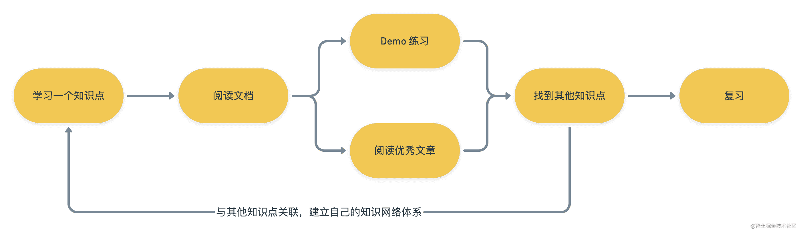

[原文连接](https://juejin.cn/post/7017645909483716615)

## 如何高效的自学

    自学是每个工程师都需要掌握的一项技能。这个学习方法笔者百试百灵，学习任何技术都会用上这个思路。另外我们还能通过这个思路拓宽自己的技术栈，将各个知识联系起来建立自己的知识体系，并且通过这种学习方式学到的知识也不容易遗忘。

## 推荐书籍

初级：
[JavaScript 高级程序设计（第 4 版）](https://book.douban.com/subject/35175321/)

中级：
[JavaScript 忍者秘籍（第 2 版）](https://book.douban.com/subject/30143702/)

[你不知道的 JS 三卷](https://book.douban.com/subject/26351021/)
[你不知道的 JS 英文](https://github.com/getify/You-Dont-Know-JS)

高级:
[JavaScript 悟道](https://book.douban.com/subject/35469273/)
[JavaScript 语言精髓与编程实践（第 3 版）](https://book.douban.com/subject/35085910/)
